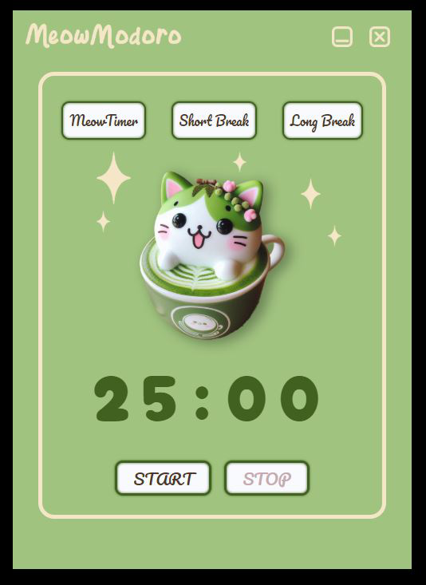

# Meowmodoro App

Meowmodoro is a minimal Electron application designed to help you stay focused using the Pomodoro Technique. It features a delightful matcha cat latte theme, bringing a touch of zen to your productivity.

## Features
* **Pomodoro Timer:** 25 minutes of focused work.
* **Short Break Timer:** 5 minutes for a quick recharge.
* **Long Break Timer:** 10 minutes for a more extended rest.
* **Alarm Sound:** A gentle alarm to signal the end of each timer.
* **Matcha Cat Latte Theme:** A calming and visually appealing design.
* **Minimalist Interface:** Clean and easy to use.
* **JavaScript Powered:** Built using JavaScript and Electron.
## Recommended IDE Setup

- [VSCode](https://code.visualstudio.com/) + [ESLint](https://marketplace.visualstudio.com/items?itemName=dbaeumer.vscode-eslint) + [Prettier](https://marketplace.visualstudio.com/items?itemName=esbenp.prettier-vscode)

## Installation
1. **Clone the repository:**
   ```bash
   git clone https://github.com/ellabach294/meowmodory-electron-app.git
   ```
2. **Install dependencies:**
   ```bash
   npm install
   ```
3. **Run the application:**
   ```bash
   npm run dev
   ```

## Usage
1. Launch the Meowmodoro application.
2. Select the desired timer (Pomodoro, Short Break, or Long Break)
3. The timer will start automatically.
4. An alarm sound will play when the timer reaches zero.
5. Enjoy your productive and relaxing sessions!

## Contributing

Contributions are welcome! If you have any suggestions or find any bugs, please feel free to open an issue or submit a pull request.

## Screenshot

